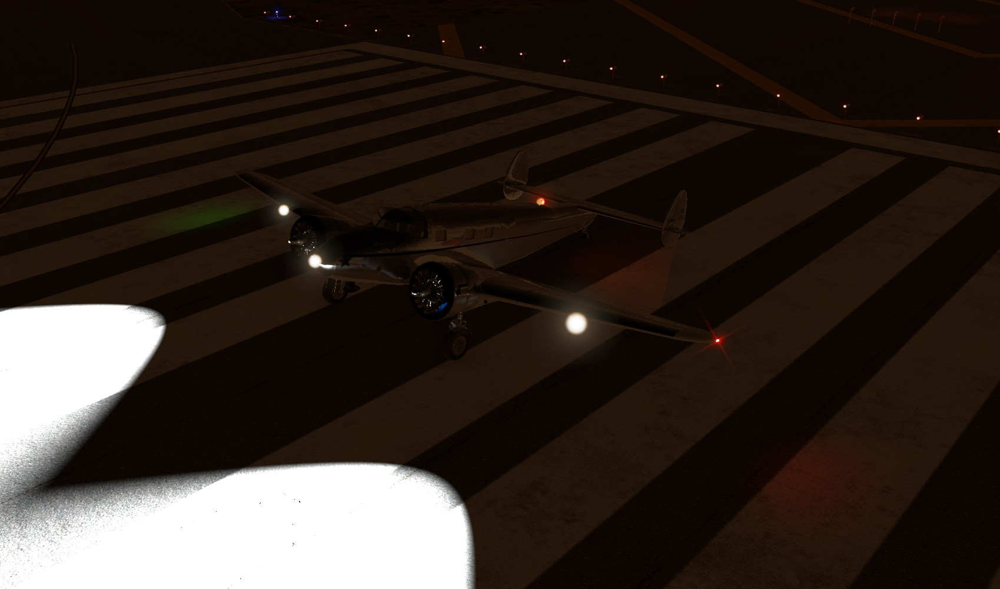
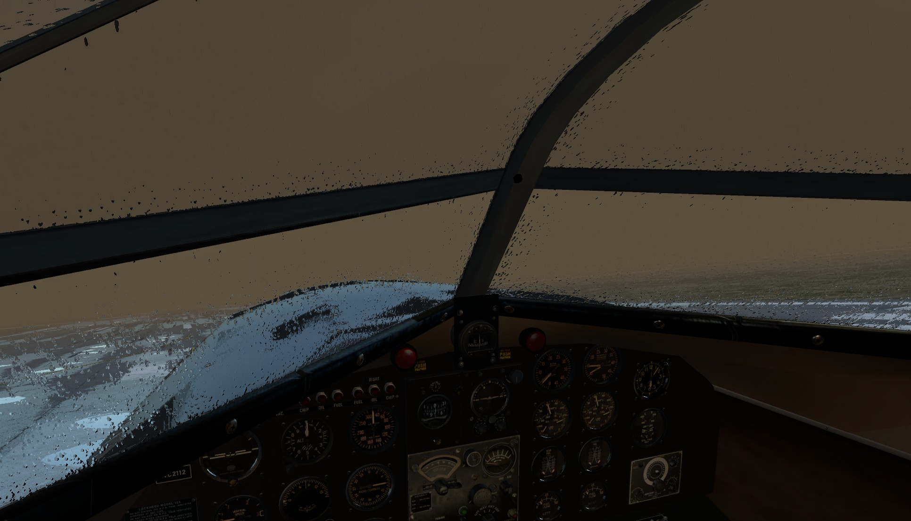
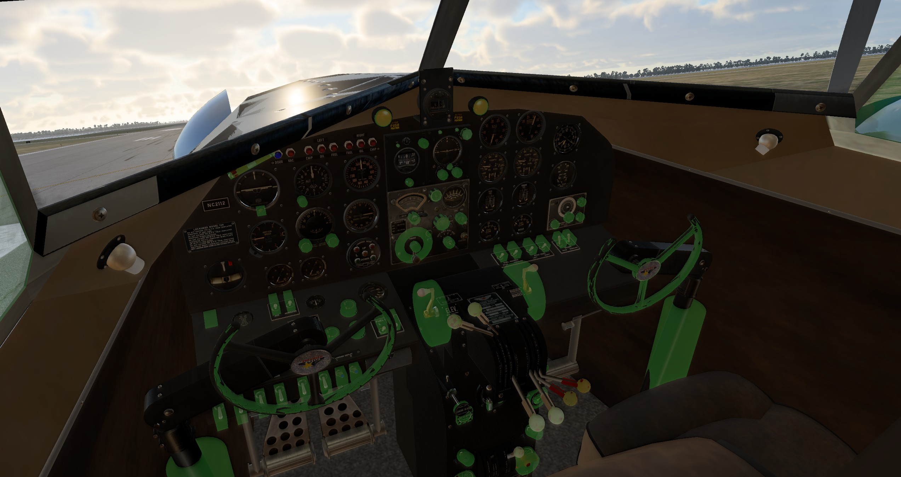
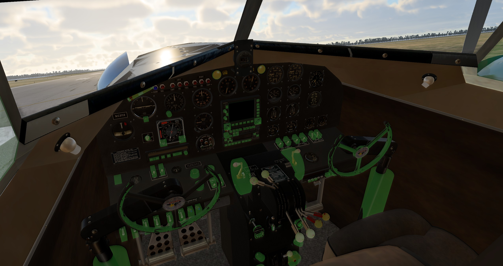
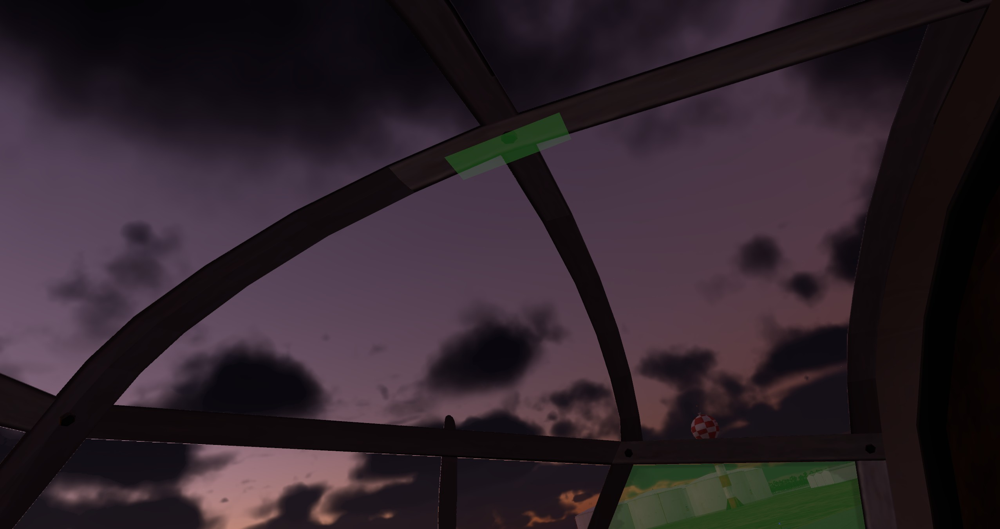

# Lockheed L-12a for X-Plane 12

This repository offers a modified and extended version of [Steve "humbug01" Baugh's Lockheed L-12a Electra Junior](https://forums.x-plane.org/index.php?/files/file/75273-lockheed-model-12a-electra-junior/) for X-Plane 12 (with permission from the author).

**This is for X-Plane 12 beta 14 and newer only!**





&nbsp;

<a name="toc"></a>
## Table of Contents
1. [Changes from the original model](#1.0)
2. [Installation](#2.0)
3. [Liveries](#3.0)
4. [Notes](#4.0)
4. [Known Issues](#5.0)
5. [Credits](#6.0)
6. [License](#7.0)

&nbsp;

<a name="1.0"></a>
## 1. Changes from the original model

The model was made from the [2.0.0 release for X-Plane 11](https://forums.x-plane.org/index.php?/files/file/75273-lockheed-model-12a-electra-junior/) . All changes are relative to that release.

&nbsp;

### 1.1 Aircraft Configuration File

- Unified the modern and vintage models into a single aircraft file to facilitate updates.
- X-Plane 12 payload stations.

&nbsp;

### 1.2 Exterior

- Pilot is hidden when master switch is off.
- Glass and solid cockpit roof types can now be switched via manipulator.
- Independent left and right landing lights.

&nbsp;

### 1.3 Interior

- Glass and solid cockpit roof types can now be switched via manipulator.

&nbsp;

### 1.4 Interactive elements

- Reworked all manipulators and all now have tool tips.
- Number of custom commands greatly cut down.
- New manipulators for the yokes.
- Manipulators to toggle between cockpit types (modern/vintage).
- Manipulators to toggle roof type (solid/glass).
- Control lock lever works now.

&nbsp;

### 1.5 Plugins/Scripts

- Updated xlua to release 1.2.0.
- Rewrote ARN-7 vintage nav radio logic for more robustness.
- Rewrote RCA com radio logic for 8.33 kHz capability and more robustness.
- Rewrote fuel system logic. Fuel gauge indication is now affected by aircraft pitch.
- Reworked ignition system logic. Magneto selectors now operable independently of master ignition switch position. However, actual engine ignition will only be available if master ignition is on.
- Rewrote lights logic. True independent left and right landing lights that turn on with the main switch on and when deployed. Nose light now requires that the baggage door is closed.
- Added a livery configuration script. See "[Liveries](#3.0)" below.

&nbsp;

<a name="2.0"></a>
## 2. Download and Installation

- Press the green "Code" button above and choose "Download ZIP" or click [here](https://github.com/JT8D-17/lockheed-l12-xplane/archive/refs/heads/main.zip).
- Extract the zipped file.
- Optional: Remove the _"0_paintkit"_ and "_0_sources_" folder to save disk space if you do not need them.
- Put the _"Lockheed_L-12a"_ folder (rename it, if you want to) into _"X-Plane 12/Aircraft"_ (or where ever else you keep your add-on aircraft).

Because the fmod sounds are not included due to licensing issues:
- Download the [original v2.0.0 release of the L-12a](https://forums.x-plane.org/index.php?/files/file/75273-lockheed-model-12a-electra-junior/).
- Add the "fmod" folder from the original 2.0.0 download to the _"Lockheed_L-12a"_ folder and rename _fmod/L12a.snd_ to _fmod/L12a_XP12.snd_.  
- Then either modify the fmod file as per my instructions [in the project wiki](https://github.com/JT8D-17/lockheed-l12-xplane/wiki/Do-it-yourself-fmod-snd-file-editing) or live with a few bugs and missing sounds.

If successful, there will be a separate UI entry named _"Lockheed L-12a"_ in X-Plane 12's aircraft menu.

&nbsp;

<a name="3.0"></a>
## 3. Liveries

### 3.1 Compatibility

Repaints done for release 2.0.0 are generally compatible to this one.   
**All textures and thumbnails must be renamed to _L12a_XP12_icon11.png_ and _L12a_XP12_icon11_thumb.png_ **

&nbsp;

### 3.2 Livery configuration

Adding a "_liveryconfig.txt_" file to any livery folder (e.g. _"liveries/[Your livery folder]/liveryconfig.txt"_ ) will apply an individual aircraft configuration to this livery. See the _"liveryconfig.txt"_ file in the L-12a's root folder that configures the default livery for an example.

Available configuration options (only use one value per line):

```
Roof=[Solid/Glass]
Panel=[Vintage/Modern]
```

Notes:
- _Roof_ switches between the _Solid_ or _Glass_  roof. The default value is _Solid_, if this line is not provided.   
-  _Panel_ switches between the _Vintage_ and _Modern_ panels. The default value is _Vintage_, if this line is not provided.

&nbsp;

<a name="4.0"></a>
## 4. Notes

General information:

- Manuals for the X-Plane version of the L-12 are located inside the "manuals" folder.
- Documentation about real L-12s and other reference material can be found in the "documents" folder.
- The paint kit for creating liveries (in [GIMP .xcf](https://www.gimp.org/) format) is in the "0_paintkit" folder.

Vintage panel manipulators: 


Modern panel manipulators:


Cockpit ceiling manipulator:


Useful enhancements for the L-12:

- [Checklists for the Xchecklist plugin](https://forums.x-plane.org/index.php?/files/file/75723-checklist-clisttxt-for-the-humbug01-lockheed-model-12a/)
- [Liveries](https://forums.x-plane.org/index.php?/search/&q=lockheed%20l-12a&type=downloads_file&search_and_or=and)


&nbsp;

<a name="5.0"></a>
## 5. Known issues

**No fmod sounds are included due to licensaing issues. Fmod files from the original download have to be modified manually. See the installation instructions.**

See the ["Issues" tab](https://github.com/JT8D-17/lockheed-l12-xplane/issues) of this repository.   
Feel free to add any issues there if you happen to have a Github account.

&nbsp;

<a name="6.0"></a>
## 6. Contributors/Credits

- Steve Baugh: [Lockheed L-12a 2.0.0 model, textures, animations, manipulators, Lua scripts](https://forums.x-plane.org/index.php?/files/file/75273-lockheed-model-12a-electra-junior/)
- Laminar Research: [Xlua 1.2.0](https://github.com/X-Plane/XLua)
- BK (me): Improvements post-v2.0.0 (see [section #1](#1.0))

&nbsp;

<a name="7.0"></a>
## 7. License

<a rel="license" href="http://creativecommons.org/licenses/by-nc-sa/4.0/"></a><br />This work is licensed under a <a rel="license" href="http://creativecommons.org/licenses/by-nc-sa/4.0/">Creative Commons Attribution-NonCommercial-ShareAlike 4.0 International License</a>.
