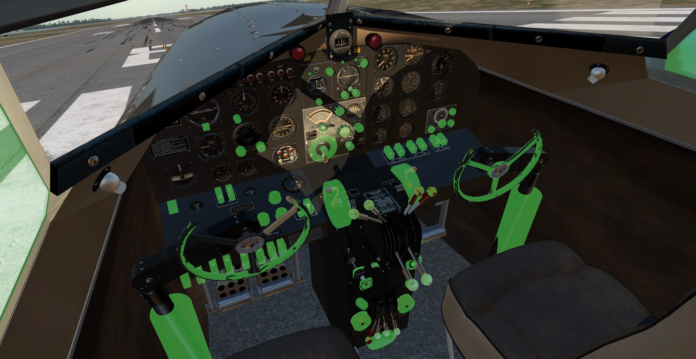

# Lockheed L-12a for X-Plane 12

This repository offers a modified and extended version of [Steve Baugh's's Lockheed L-12a Electra Junior](https://forums.x-plane.org/index.php?/files/file/75273-lockheed-model-12a-electra-junior/) for X-Plane 12 (with permission from the author).

**This is for X-Plane 12 beta 14 and newer only!**


&nbsp;

<a name="toc"></a>
## Table of Contents
1. [Changes from the original model](#1.0)
2. [Installation](#2.0)
3. [Repaints/Aircraft Configuration](#3.0)
4. [Notes](#4.0)
4. [Known Issues](#5.0)
5. [Credits](#6.0)
6. [License](#7.0)

&nbsp;

<a name="1.0"></a>
## 1. Changes from the original model

See the ["Notes"](#4.0) section for any known issues and the ["Credits"](#5.0) section for links to the original modification or source material (if applicable).   
The baseline version was 2.0.0.

&nbsp;

### 1.1 Aircraft Configuration File

- Unified the modern and vintage models into a single aircraft file to facilitate updates. See ["Repaint compatibility"](#3.0) below for configuring present and future repaints.
- X-Plane 12 payload stations.

&nbsp;

### 1.2 Exterior

- Pilot is hidden when master switch is off.
- Glass and solid cockpit roof types can now be switched via manipulator.
- Independent left and right landing lights.

&nbsp;

### 1.3 Interior

- Glass and solid cockpit roof types can now be switched via manipulator.

&nbsp;

### 1.4 Interactive elements

- Reworked all manipulators and all now have tooltips.
- Number of custom commands greatly cut down.
- New manipulators for the yokes.
- Manipulators to toggle between cockpit types (modern/vintage)
- Manipulators to toggle roof type (solid/glass)
- Control lock lever works now.

&nbsp;

### 1.5 Systems

- Rewrote ARN-7 vintage nav radio logic for more robustness.
- Rewrote RCA com radio logic for 8.33 kHz capability and more robustness.
- Rewrote fuel system logic. Fuel gauge indication is now affected by aircraft pitch.
- Reworked ignition system logic. Magneto selectors now operable independently of master ignition switch position. However, actual engine ignition will only be available if master ignition is on.
- Rewrote lights logic. True independent left and right landing lights that turn on with the main switch on and when deployed. Nose light now requires that the baggage door is closed.

&nbsp;

### 1.6 Sounds

- Unified modern and vintage sound files.

&nbsp;

<a name="2.0"></a>
## 2. Download and Installation

- Press the green "Code" button above and choose "Download ZIP" or click [here](https://github.com/JT8D-17/lockheed-l12-xplane/archive/refs/heads/main.zip).
- Extract the zipped file.
- Put the _"lockheed-l12-xplane-main"_ folder (rename it, if you want to) into _"X-Plane 12/Aircraft"_ (or where ever else you keep your add-on aircraft).

If successful, there will be a separate UI entry named _"Lockheed L-12A"_ in X-Plane 12's aircraft menu.

&nbsp;

<a name="3.0"></a>
## 3. Repaints/Aircraft Configuration

### 3.1 Compatibility

Repaints done for the base model are generally compatible to this one.

&nbsp;

### 3.2 Livery configuration files

A livery can permanently be configured for a certain roof or panel type by with a "_liveryconfig.txt_" file inside of a livery folder (e.g. _"liveries/[Your livery folder]/liveryconfig.txt"_ ).    
A _"liveryconfig.txt"_ file in the L-12a's root folder will configure the default livery.

Livery configuration options (only use one value per line):
```
Roof=[Solid/Glass]
Panel=[Vintage/Modern]
```

Parameter notes:   
>  _Roof_ switches between the _Solid_ or _Glass_  roof. The default value is _Solid_, if this line is not provided.   
> _Panel_ switches between the _Vintage_ and _Modern_ panels. The default value is _Vintage_, if this line is not provided.

&nbsp;

<a name="4.0"></a>
## 4. Notes

Hints, tips, etc.

- [Checklists for the Xchecklist plugin](https://forums.x-plane.org/index.php?/files/file/75723-checklist-clisttxt-for-the-humbug01-lockheed-model-12a/)
- [Liveries](https://forums.x-plane.org/index.php?/search/&q=lockheed%20l-12a&type=downloads_file&search_and_or=and)
- Manipulators: 


&nbsp;

<a name="5.0"></a>
## 5. Known issues

See the ["Issues" tab](https://github.com/JT8D-17/lockheed-l12-xplane/issues) of this repository.   
Feel free to add any issues there if you happen to have a Github account.

&nbsp;

<a name="6.0"></a>
## 6. Contributors/Credits

- Steve Baugh, Dan Hopgood [Lockheed L-12a](https://forums.x-plane.org/index.php?/files/file/75273-lockheed-model-12a-electra-junior/)
- BK (me)

&nbsp;

<a name="7.0"></a>
## 7. License

<a rel="license" href="http://creativecommons.org/licenses/by-nc-sa/4.0/"></a><br />This work is licensed under a <a rel="license" href="http://creativecommons.org/licenses/by-nc-sa/4.0/">Creative Commons Attribution-NonCommercial-ShareAlike 4.0 International License</a>.
